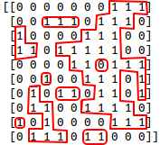
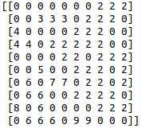
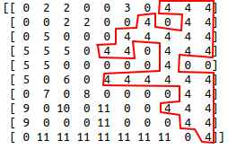
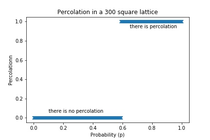
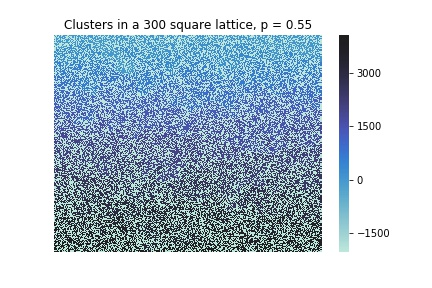
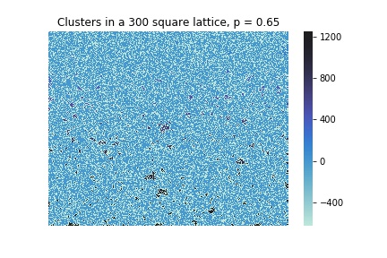
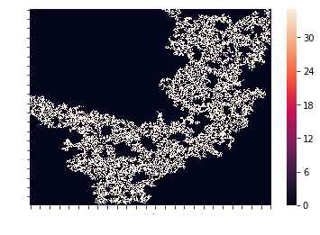

# Calculation of the percolation threshold with Logistic Regression
## Introduction
Percolation theory shows how a network behaves when nodes or links are added. This is a geometric type of phase transition, because at a critical moment in the addition, the network of small disconnected clusters joins to form a significantly larger connected structure, giving rise to what is known as a percolation cluster.

Some examples of percolation are the water passing through the ground coffee in a coffee maker, the extraction of oil from the subsoil, the percolation of infections or epidemics through a population.

## Percolation model in a square lattice
One of the most popular models is the study of percolation in a square lattice of dimensions N. With a probability p the different cells will be occupied; if an occupied cell is in contact with its nearest neighbors, that is, the grid above, below, on its left and on its right form a cluster whose size will be the number of neighbors that are in contact. If there is a cluster that goes through the entire network, it will then be the percolation cluster and therefore we will say that there is percolation in the given network.

To generate a network, we are going to fill in a square matrix with zeros and ones, the zeros being empty cells and the ones being occupied cells. We are going to use a parameter p "the probability that a cell is occupied", when generating a random number between 0 and 1 if it is less than p then we will fill the cell with a 1, otherwise we will fill it with a 0 ( you can see the function net in percolation_function.py).
                         

  

    <em>Figure 1: Different clusters in a network of size 10</em>

Once the matrix of size N is filled with zeros and ones, we label the clusters that have been formed in the network, so we are going to replace the ones with numbers greater than one, for example the first cluster found is labeled with the number 2, the next with the number 3 and so on
(you can see the algorithm in the function clusterization in percolation_funtion.py).

  

    <em>Figure 2: Enumeration of the different clusters of the above network</em>

Once the matrix is labeled, we see if one of the labeled numbers in the first row of the matrix coincides with at least one of the number labeled in the last row. If this happens, we will say that there is percolation and otherwise there is not (class Percolation in percolation_function.py).

  

    <em>Figure 3: Example of a percolation cluster</em>

## Data analysis
The data analysis will be performed in percolation.ipynb

It is normal to think that when p has a small value, most of the cells will be filled by zeros and therefore there will be no percolation, otherwise, when p has a high value, most of the cells will be occupied by ones being connected to each other and by so much there will be percolation. Because there are two types of groups when classifying a network, that is, "there is percolation" and "there is no percolation", it is a binary classification problem.
To calculate the percolation threshold we are going to use the probability of percolation p as the only parameter; We will use 1000 different probabilities spaced between zero and one. Each probability will have an associated boolean value of "TRUE" when there is percolation and "FALSE" when there is not. The size of the lattice will be 300 X 300 cells, a size large enough to approach the thermodynamic limit of a lattice of infinite size.

  

    <em>Figure 4: Representation of the probability as a function of percolation in a lattice of size 300</em>

  

    <em>Figure 5: Example of when there is no percolation. the minimum value of the heat map represents the empty cells, from the value two to the maximum represents the different clusters.</em>

  

    <em>Figure 6: Example of when there is percolation. the minimum value of the heat map represents the empty cells, from the value two to the maximum represents the different clusters.</em>

In Figure 4 we clearly see that a phase change happens around the value p=0.6. To estimate this value in a more exact way, we are going to use Logistic Regression since there are enough indications that the behavior is linear. Now we use 80% of the data to train the algorithm while we leave the remaining 20% to test the algorithm fits well with the proposed data. We see that the algorithm has an accuracy of more than 99%, it also hits 99% of the values that we had left to predict whether or not there is percolation, therefore we can affirm that the Logistic Regression algorithm is a good choice for calculating the percolation threshold. Finally, obtaining the linear parameters of Logistic Regression, the percolation threshold can be easily calculated obtaining p = 0.58998392, quite close to what we had intuitively seen graphically.

## Conclusions
The value of the percolation threshold is a well-known value around 0.592… [3] so as a conclusion we can state that the Logistic Regression algorithm has been a good choice for its calculation. We also conjecture that the greater the size of the network, the percolation threshold value will be closer to the value obtained in [1]. Finally, it is interesting to study the properties of the percolation cluster when the probability is equal to that of the threshold, such as fractality (Figure 6), fractal dimension, power laws, etc. However, it will be left for another topic.

  

    <em>Figure 7: Percolation cluster for p = p_c</em>

## References
1. D. Stauffer y A. Aharony, Introduction to Percolation Theory Taylor and Francis, London(1992); revised 2nd edition (1994).
2. https://ergodic.ugr.es/cphys/LECCIONES/percolacion/percolacion.pdf
3. Derrida, B.; D. Stauffer (1985). "Corrections to scaling and phenomenological renormalization for 2-dimensional percolation and lattice animal problems". J. Physique. 46 (45): 1623
4. https://realpython.com/logistic-regression-python/
